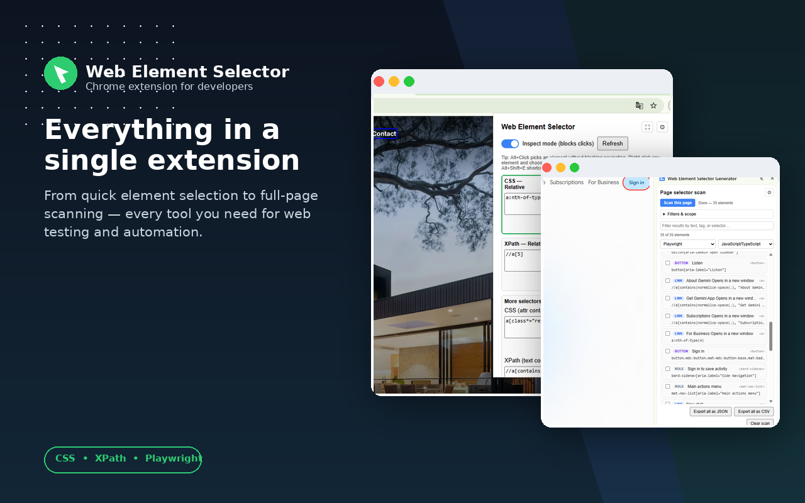
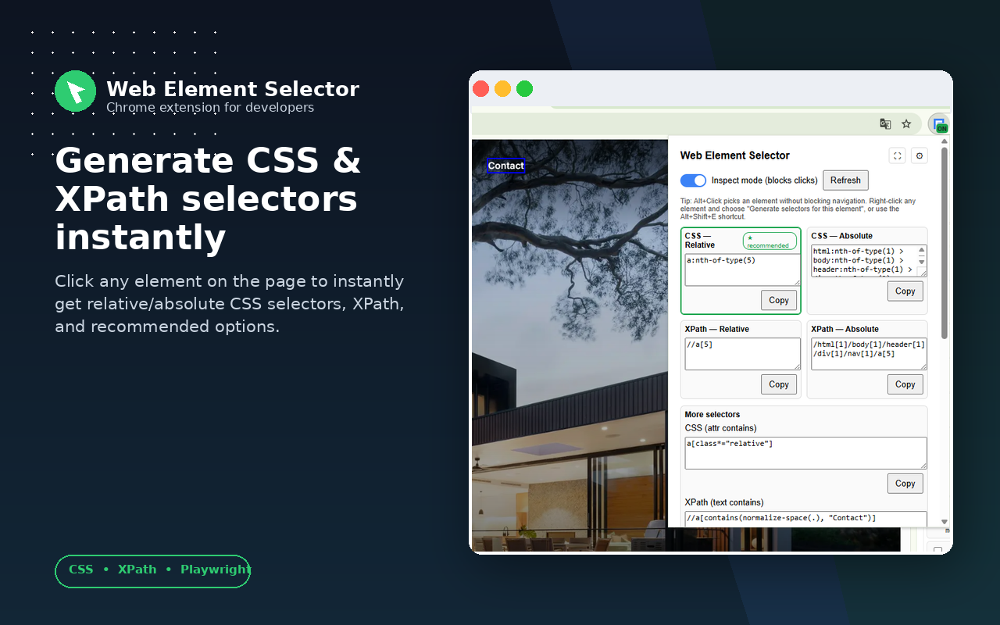
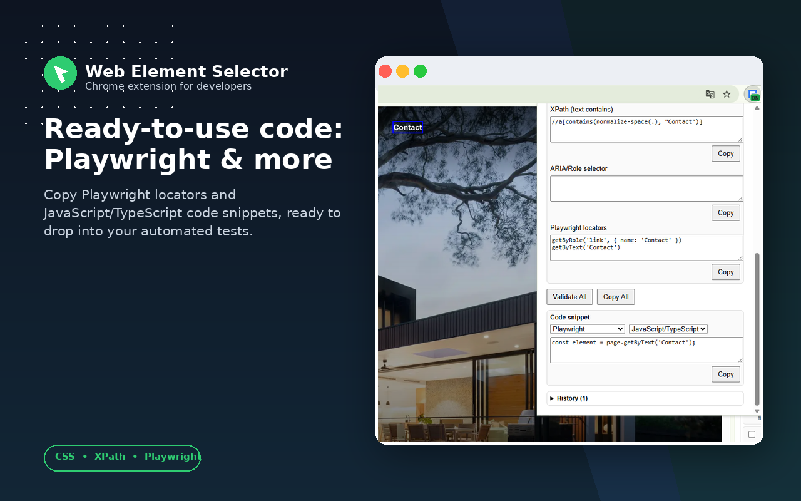
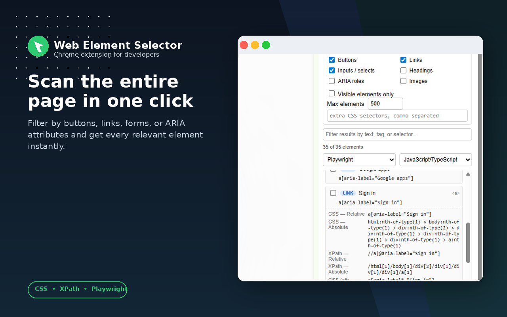
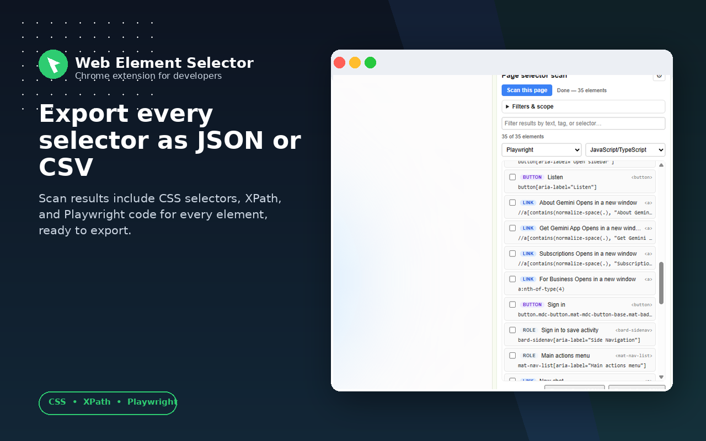

# Web Element Selector Generator

<picture>
  <source media="(prefers-color-scheme: dark)" srcset="images/promo-dark/promo_6_overview.png">
  <source media="(prefers-color-scheme: light)" srcset="images/promo-light/promo_6_overview.png">
  
</picture>

A Chrome (Manifest V3) extension that turns any element — or an entire page — into ready-to-use CSS, XPath, ARIA, and Playwright locators, plus copy-paste code snippets for Selenium, Playwright, Cypress, and WebdriverIO — for test automation, web scraping, and debugging.

## Features

- 8 locator strategies generated per element: CSS relative/absolute, XPath relative/absolute, CSS attribute-contains, XPath text-contains, ARIA role/name selector, and Playwright locator code
- A "recommended" badge automatically highlights the most robust option
- **Full-page scan**: a side panel that scans every interactive element on the page (links, buttons, inputs, forms, test-id-tagged elements, and more) in one pass, across same-origin *and* cross-origin iframes, and lists every result with search/filter, hover-to-highlight on the page, and multi-select
- **Code snippets** for the most common test-automation stacks — Selenium (Java/Python/C#/JS), Playwright (JS-TS/Python/Java/C#), Cypress, and WebdriverIO — generated per element or as a ready-to-paste Page Object class for a whole batch of selected elements
- Works inside open shadow roots and same-origin iframes
- "Validate All" checks every generated selector live against the page and reports match counts
- Per-tab selection history (last 25 picks), browsable from the popup
- Right-click context menu entry point and an `Alt+Shift+E` keyboard shortcut
- Settings page: configurable attribute priority order, default code-snippet framework/language, plus JSON/CSV export of selection history
- Everything runs locally — no data ever leaves your browser

## How it works

The extension has six parts:

- **`content.js`** — injected into every frame of every page (`all_frames: true`). It listens for hover, click, right-click, and keyboard events, walks the DOM/shadow tree from the picked element, and builds all 8 locator strings, testing each candidate for uniqueness via `querySelectorAll`/`document.evaluate` before returning it. It also exposes a full-page scan mode: given a set of categories (links, buttons, inputs, test-id attributes, etc.), it walks the frame's DOM — including open shadow roots — collects matching elements in chunks (yielding to the browser between batches so large pages don't jank), and builds the same 8-strategy payload for each.
- **`background.js`** — the service worker. It relays messages between content scripts, the popup, and the side panel; keeps a per-tab selection history in `chrome.storage.local`; tracks inspect-mode state in `chrome.storage.session` (survives service worker restarts); manages the badge/context menu/keyboard shortcut; orchestrates full-page scans by enumerating every frame in the tab (`chrome.webNavigation.getAllFrames`) and asking each frame's own content-script instance to scan itself — which is what lets the scan reach cross-origin iframes, since each frame's content script runs independently of the others regardless of origin; and cleans up a tab's cached data when it closes.
- **`popup.html`/`popup.js`** — the UI you see when clicking the toolbar icon: the 8 generated fields, the recommended badge, a code-snippet panel (pick a framework/language, copy the generated locator), the history panel, the inspect-mode toggle, and a button to open the full-page scan side panel.
- **`sidepanel.html`/`sidepanel.js`** — the full-page scan panel. Scan the current page, filter by element category or free-text search, hover a result to highlight it live on the page, expand a row for all 8 locator strategies plus a code snippet, multi-select rows, and export selected elements as a Page Object class or the whole result set as JSON/CSV.
- **`snippets.js`** — framework-agnostic code-snippet generator shared by the popup and side panel. Given an element's locator payload, it produces an idiomatic one-line locator statement (`page.getByTestId(...)`, `driver.findElement(By.cssSelector(...))`, `cy.get(...)`, `$(...)`, etc.) or a full Page Object class skeleton for a batch of elements, per framework and language.
- **`options.html`/`options.js`** — the settings page: reorder which attributes (`data-testid`, `data-qa`, etc.) are preferred when building selectors, set the default code-snippet framework/language, and export your selection history.

## Screenshots

<table>
  <tr>
    <td></td>
    <td></td>
  </tr>
  <tr>
    <td></td>
    <td></td>
  </tr>
</table>

## Installation

**From source (development):**
1. Clone this repo.
2. Open `chrome://extensions` in Chrome.
3. Enable **Developer mode** (top right).
4. Click **Load unpacked** and select the project folder.

**From the Chrome Web Store:** search for "Web Element Selector Generator" (or use the store link once published).

## Usage

1. **Pick an element** — three ways to do it:
   - Toggle **Inspect mode** in the popup, then click an element on the page (this blocks the click's normal behavior, e.g. link navigation).
   - Hold **Alt** and click an element anywhere, anytime — this does *not* block normal page behavior (links still navigate, buttons still submit).
   - Right-click any element and choose **"Generate selectors for this element"** from the context menu — no need to open the popup first.
   - Or press **Alt+Shift+E** to toggle Inspect mode from the keyboard.
2. **Open the popup** (click the toolbar icon) to see all 8 generated selectors. The card with the green "★ recommended" badge is the one most likely to be both unique and stable.
3. **Copy** any individual field with its Copy button, or use **Copy All** to grab every selector at once with labels.
4. Pick a **framework and language** in the Code Snippet section to get a ready-to-paste locator statement (Selenium, Playwright, Cypress, or WebdriverIO) for the currently selected element.
5. Click **Validate All** to re-check each selector against the live page and confirm it matches exactly one element.
6. Click **Refresh** if the page changed after you picked the element (e.g. a class was added dynamically) to recompute selectors for the same element.
7. Open the **History** panel to revisit earlier picks from the current tab, or clear it.
8. Click the ⚙ **settings** icon to reorder attribute priority, set your default snippet framework/language, or export your history as JSON/CSV.

## Scanning a whole page

Click the **⛶ panel icon** in the popup (or open the extension's side panel directly) to scan every element on the page at once:

1. Optionally adjust **Filters & scope** — which categories to include (links, buttons, inputs, forms, test-id attributes, headings, ARIA roles, images), a "visible only" toggle, a max-elements cap, and extra custom CSS selectors.
2. Click **Scan this page**. The panel asks every frame in the tab (including cross-origin iframes) to scan itself and streams results in as they arrive.
3. Use the **search box** to filter results by text, tag, selector, or frame URL.
4. **Hover** a row to highlight that element live on the page; **click** a row to expand all 8 locator strategies plus a generated code snippet for the framework/language chosen above the list.
5. **Check** rows to multi-select them, then **Copy selected as code** or **Export page object…** to download a ready-to-paste Page Object class containing all selected elements.
6. **Export all as JSON/CSV** to save the full scan, or **Clear scan** to start over.

The panel persists its last scan per tab (via `chrome.storage.session`), so reopening it after closing shows your previous results — re-scan if the page has changed since.

## Use cases

- **Writing test automation** — generate ready-to-paste Selenium (Java/Python/C#/JS), Playwright (JS-TS/Python/Java/C#), Cypress, or WebdriverIO code, without hand-crafting locators in devtools.
- **Bootstrapping a Page Object Model** — scan a page once, select the elements you care about, and export a full Page Object class skeleton in your stack of choice instead of writing every locator by hand.
- **QA / manual testing** — quickly check whether an element has a stable, unique selector before handing it off to an automation engineer, using "Validate All".
- **Web scraping** — get a unique CSS or XPath path to a data element without writing your own selector logic, or scan a whole page/listing at once for bulk extraction targets.
- **Accessibility auditing** — the ARIA/Role selector output surfaces an element's accessible role and name, useful when reviewing a11y coverage; the page scan's "ARIA roles" filter surfaces every landmark at once.
- **Debugging dynamic UIs** — the shadow DOM and iframe support helps when the element you care about lives inside a web component or an embedded widget, where devtools' own "Copy selector" typically falls short.
- **Working with legacy pages that lack test IDs** — the attribute-priority and multiple fallback strategies (text-contains, attribute-contains, absolute path) mean you still get something usable even without `data-testid` hooks.

## Permissions

| Permission | Why it's needed |
|---|---|
| `activeTab` / `scripting` | Run the "Validate All" selector check against the current tab |
| `storage` | Save selection history, inspect-mode state, scan results, and settings locally |
| `contextMenus` | Add the right-click "Generate selectors for this element" entry |
| `sidePanel` | Host the full-page scan panel |
| `webNavigation` | Enumerate every frame in a tab so a page scan can reach each one (including cross-origin iframes) |
| `<all_urls>` content script match | The selector engine needs to run on whatever page you're inspecting |

No data is transmitted anywhere — history, scan results, and settings are stored only in your own Chrome profile.

## Known limitations

- Closed shadow roots are not accessible from page-level scripts (a browser restriction, not something this extension can work around).
- XPath selectors are not generated for elements inside a shadow root, since XPath 1.0 doesn't reliably cross shadow boundaries — use the CSS or Playwright output instead in that case.
- A single element's own cross-frame CSS/XPath computation can't reach into a cross-origin iframe (same restriction devtools has). The full-page **scan**, however, does reach cross-origin iframes, because it asks each frame's own content-script instance to scan itself rather than trying to access its DOM from outside.
- Cypress has no native XPath support; if an element's best strategy is XPath-based, the Cypress snippet falls back to CSS where possible and otherwise notes that the `cypress-xpath` plugin is required.
- Requires Chrome 114+ for the side panel API.

## Project structure

```
manifest.json        Extension manifest (MV3)
background.js         Service worker: history, badge, context menu, shortcuts, page-scan orchestration
content.js            Selector-building + full-page scan engine, injected into every frame
snippets.js           Code-snippet generators (Selenium/Playwright/Cypress/WebdriverIO), shared by popup + side panel
popup.html/js/css     Toolbar popup UI
sidepanel.html/js/css Full-page scan side panel UI
options.html/js/css   Settings page UI
icons/                Toolbar icons
```
